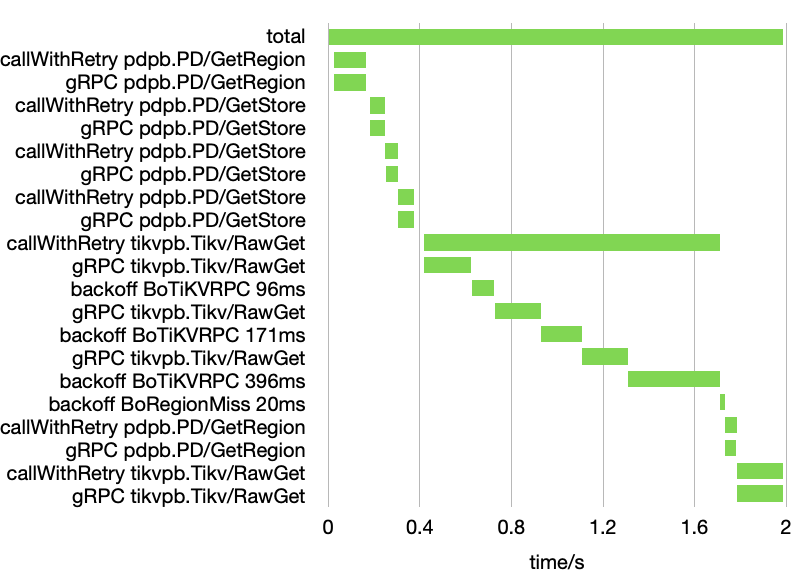
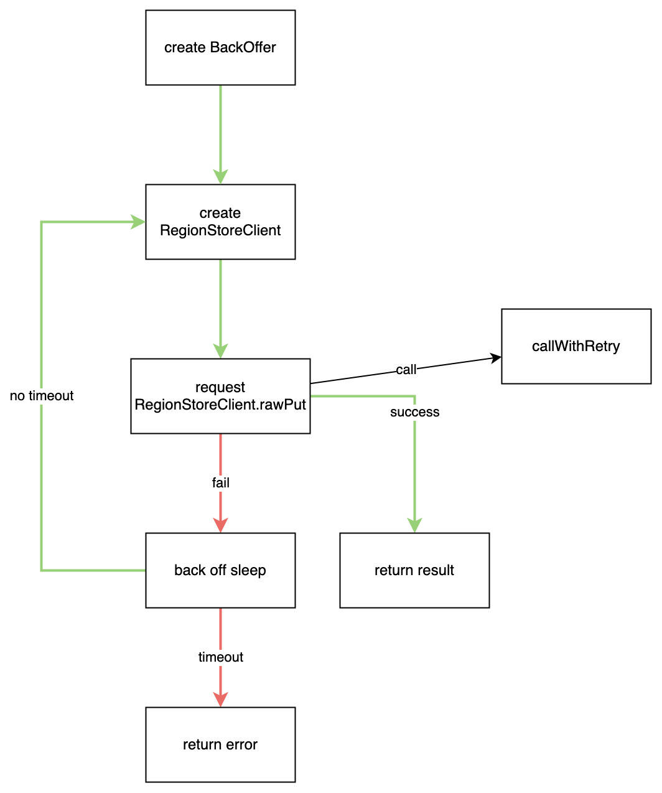

# The Lifecycle of A Request

The client talks to TiKV store directly using gRPC requests, which are created in RegionStoreClient. If a request failed, the client could retry after a back off sleep. The retry logic is delegated to AbstractGRPCClient::callWithRetry method. callWithRetry may decide to retry request within the function, or, if the RegionStoreClient must be recreated (due to, for example, region split), return a failure and let outermost RawKVClient to do the retry.

