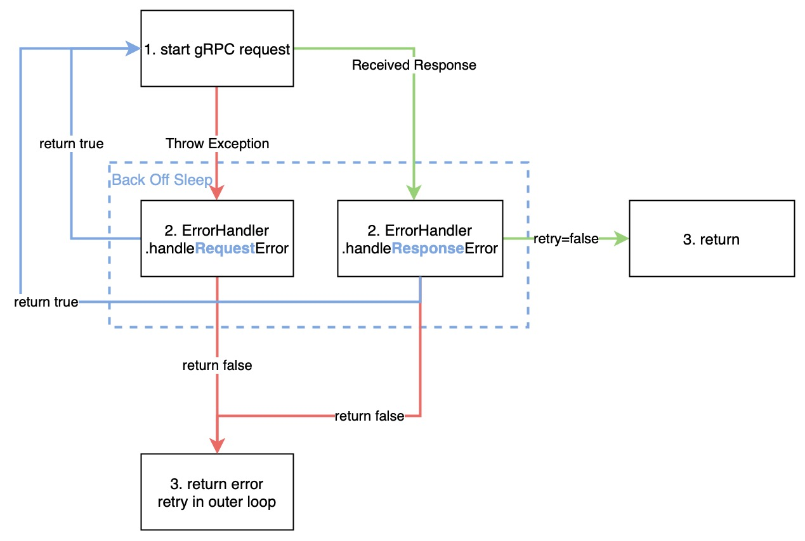

# The Lifecycle of A Request

The client talks to TiKV store directly using gRPC requests, which are created in RegionStoreClient. If a request failed, the client could retry after a back off sleep. The retry logic is delegated to AbstractGRPCClient::callWithRetry method. callWithRetry may decide to retry request within the function, or, if the RegionStoreClient must be recreated (due to, for example, region split), return a failure and let outermost RawKVClient to do the retry.

## BackOffer

The sleep and timeout mechanism is controlled by a BackOffer object, which is created one per RawKVClient method. The BeckOffer will decide how much time the next sleep will spend, and whether enough time is spent and no more retry should be applied.
If we need a back off sleep, we call backOffer.doBackOff(funcType, exception), and the current thread will sleep for a decided time. If the current operation will timeout after sleep, the doBackOff simply throw an exception to abort the operation.

## callWithRetry

RegionStoreClient.callWithRetry inherits from AbstractGRPCClient.callWithRetry. The concrete logic is in RetryPolicy.callWithRetry, which implements a retry mechanism, but the specific retry strategy is determined by the ErrorHandler.
ErrorHandler’s handler{Request, Response}Error function returns a boolean value indicating whether to retry inside callWithRetry.
The control flow for callWithRetry is as follows:

The error handler is chosen obeying the following table:

| gPRC request	| the result	| handler |
| -- | -- | -- |
| throws exception	| -	| handleRequestError
| no exception	| is null	| handleRequestError
| no exception	| is error	| handleResponseError
| no exception	| normal	| normal return

The handleRequestError function copes with the following situations:

| situation  | retry within callWithRetry | note   |
|----------|---------------|------------------------------|
| invalid store in region manager  | true  | refresh ClientStub  |
| region has not got multiple copies  | false | |
| successfully switched to new leader | true | |
| seekProxyStore | true if success | only when `tikv.enable_grpc_forward` is set |
| other | false | |

The handleResponseError function copes with the following gRPC errors:

| error                | retry within callWithRetry |
|----------------------|----------------------------|
| NotLeader            | true if leader unchanged   |
| StoreNotMatch        | false                      |
| EphochNotMatch       | true if region epoch in `ctx` is ahead of TiKV's |
| ServerIsBusy         | true                       |
| StaleCommand         | true                       |
| RaftEntryTooLarge    | throw                      |
| KeyNotInRegion       | throw                      |
| Raft ProposalDropped | true                       |
| other                | false                      |